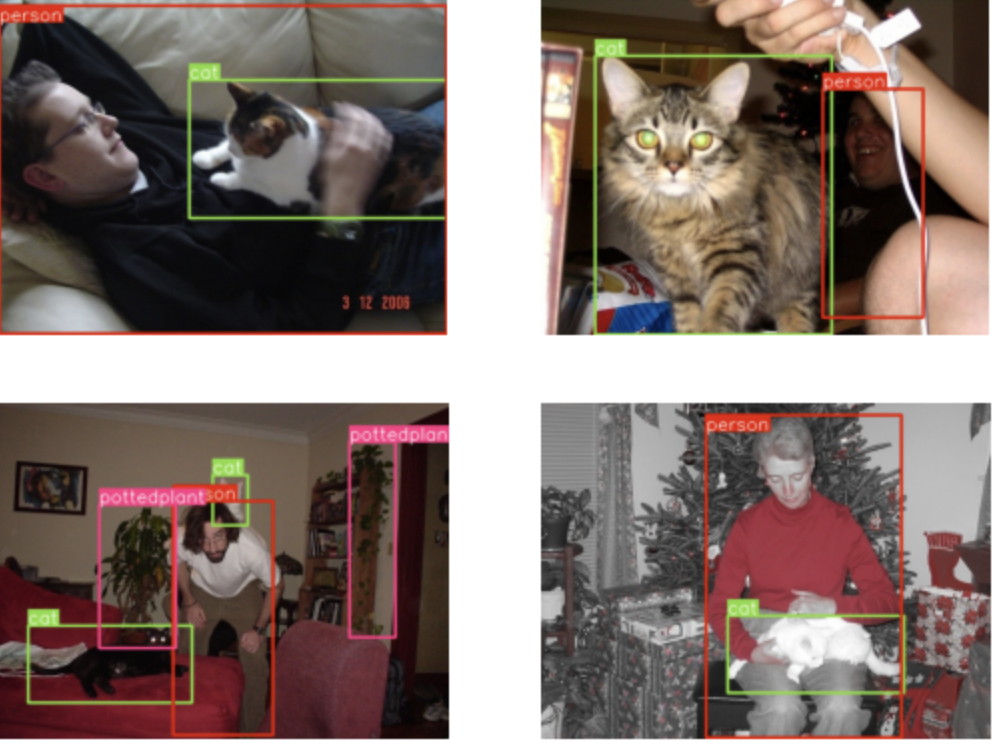
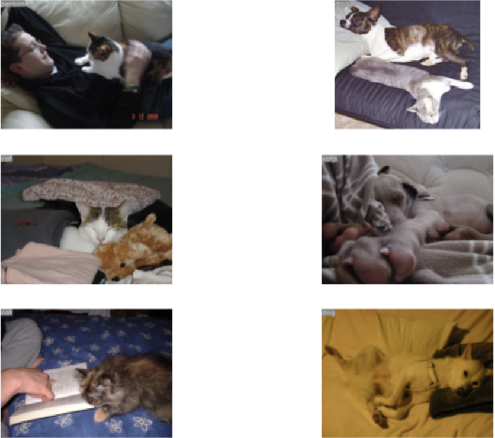
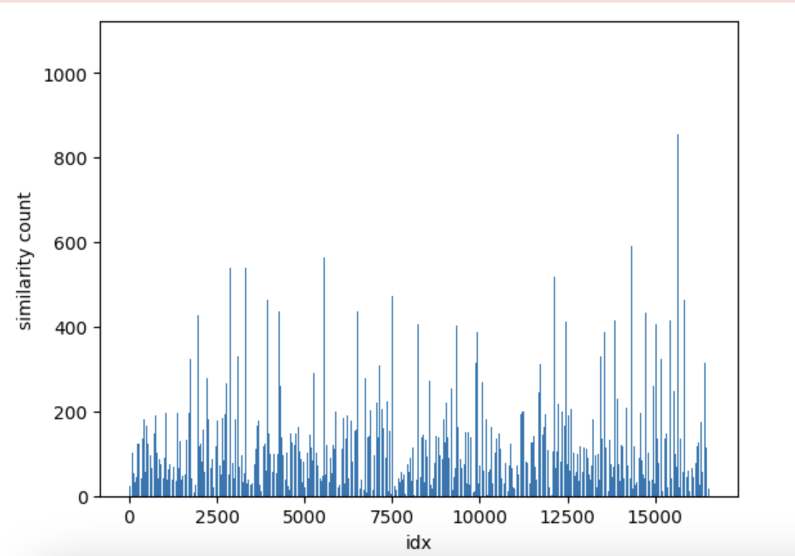

# YOLOExplorer

Explore, manipulate and iterate on Computer Vision datasets with precision using simple APIs. 
Supports SQL filters, vector similarity search, native interface with Pandas and more.

* Analyse your datasets with powerful custom queries
* Find and remove bad images (duplicates, out of domain data and more)
* Enrich datasets by adding more examples from another datasets
* And more

### Installation
```
pip install yoloexplorer
```
Building from source
```
pip install -e . 
```

## Quickstart
YOLOExplorer can be used to rapidly generate new versions of CV datasets trainable on [Ultralytics YOLO, SAM, FAST-SAM, RT-DETR](https://github.com/ultralytics/ultralytics) and more models.

Start exploring your Datasets in 2 simple steps
* Select a supported dataset or bring your own. Supports all  Ultralytics YOLO datasets currently
```python
from yoloexplorer import Explorer

coco_exp = Explorer("coco128.yaml")
```
* Build the LanceDB table to allow querying
```python
coco_exp.build_embeddings()
```
<details open>
<summary> <b> Querying Basics </b> </summary>

You can get the schema of you dataset once the table is built
```
schema = coco_exp.table.schema
```
You can use this schema to run queries

<b>SQL query</b><br/>
Let's try this query and print 4 result - Select instances that contain one or more 'person' and 'cat'
```python
df = coco_exp.sql("SELECT * from 'table' WHERE labels like '%person%' and labels LIKE '%cat%'")
coco_exp.plot_imgs(ids=df["id"][0:4].to_list())
```
Result

The above is equivlant to plotting directly with a query:
```python
voc_exp.plot_imgs(query=query, n=4)
```

<b>Querying by similarity</b><br/>
Now lets say your model confuses between cetain classes( cat & dog for example) so you want to look find images similar to the ones above to investigate.

The id of the first image in this case was 117
```python
imgs, ids = coco_exp.get_similar_imgs(117, n=6) # accepts ids/idx, Path, or img blob
voc_exp.plot_imgs(ids)
```

The above is equivlant to directly calling `plot_similar_imgs`
```python
voc_exp.plot_similar_imgs(117, n=6)
```
NOTE: You can also pass any image file for similarity search, even the ones that are not in the dataset


<b>Similarity Search with SQL Filter (Coming Soon)</b></br>
Soon you'll be able to have a finer control over the queries by pre-filtering your table
```
coco_exp.get_similar_imgs(..., query="WHERE labels LIKE '%motorbike%'")
coco_exp.plot_similar_imgs(query="WHERE labels LIKE '%motorbike%'")
```
</details>

<details>
<summary> <b>Plotting</b></summary>

| Visualization Method | Description | Arguments |
|---|---|---|
| `plot_imgs(ids, query, n=10)` | Plots the given `ids` or the result of the SQL query. One of the 2 must be provided. | `ids`: A list of image IDs or a SQL query. `n`: The number of images to plot. |
| `plot_similar_imgs(img/idx, n=10)` | Plots `n` top similar images to the given img. Accepts img idx from the dataset, Path to imgs or encoded/binary img | `img/idx`: The image to plot similar images for. `n`: The number of similar images to plot. |
| `plot_similarity_index(top_k=0.01, sim_thres=0.90, reduce=False, sorted=False)` | Plots the similarity index of the dataset. This gives measure of how similar an img is when compared to all the imgs of the dataset. | `top_k`: The percentage of images to keep for the similarity index. `sim_thres`: The similarity threshold. `reduce`: Whether to reduce the dimensionality of the similarity index. `sorted`: Whether to sort the similarity index. |

**Additional Details**

* The `plot_imgs` method can be used to visualize a subset of images from the dataset. The `ids` argument can be a list of image IDs, or a SQL query that returns a list of image IDs. The `n` argument specifies the number of images to plot.
* The `plot_similar_imgs` method can be used to visualize the top `n` similar images to a given image. The `img/idx` argument can be the index of the image in the dataset, the path to the image file, or the encoded/binary representation of the image.
* The `plot_similarity_index` method can be used to visualize the similarity index of the dataset. The similarity index is a measure of how similar each image is to all the other images in the dataset. The `top_k` argument specifies the percentage of images to keep for the similarity index. The `sim_thres` argument specifies the similarity threshold. The `reduce` argument specifies whether to reduce the dimensionality of embeddings before calculating the index. The `sorted` argument specifies whether to sort the similarity index.


</details>

<details>
<summary> <b>Add, remove, persist new Datasets and start training!</b></summary>
Once you've found the right images that you'd like to add or remove, you can simply add/remove them from your dataset and generate the updated version.

<b>Removing data</b><br/>
You can simply remove images by passing a list of `ids` from the table.
```
coco_exp.remove_imgs([100,120,300..n]) # Removes images at the given ids.
```

<b>Adding data</b><br/>
For adding data from another dataset, you need an explorer object of that dataset with embeddings built. You can then pass that object along with the ids of the imgs that you'd like to add from that dataset.
```
coco_exp.add_imgs(exp, idxs) # 
```
Note: You can use SQL querying and/or similarity searches to get the desired ids from the datasets.

<b>Persisting the Table: Create new dataset and start training</b><br/>
After making the desired changes, you can persist the table to create the new dataset. 
```
coco_exp.persist()
```
This creates a new dataset and outputs the training command that you can simply paste in your terminal to train a new model!

<b>Resetting the Table</b><br/>
You can reset the table to its original or last persisted state (whichever is latest)
```
coco_exp.reset()
```
</details>

<details>
<summary><b>(Advanced querying)Getting insights from Similarity index</b></summary>
The `plot_similarity_index` method can be used to visualize the similarity index of the dataset. The similarity index is a measure of how similar each image is to all the other images in the dataset.
Let's the the similarity index of the VOC dataset keeping all the default settings

```python
voc_exp.plot_similarity_index()
```

<br/>
You can also get the the similarity index as a numpy array to perform advanced querys.

```python
sim = voc_exp.get_similarity_index()
```
Now you can combine the similarity index with other querying options discussed above to create even more powerful queries. Here's an example:

"Let's say you've created a list of candidates you wish to remove from the dataset. Now, you want to filter out the images that have similarity index less than 250, i.e, remove the images that are 90%(`sim_thres`) or more similar to more than 250 images in the dataset.
"
```
ids = [...] # filtered ids list
filter = np.where(sim > 250)
final_ids = np.intersect1d(ids, filter) # intersect both arrays

exp.remove_imgs(final_ids)
```python
</details>


TODOs before release
- [x] Register Pypi
- [x] Add more tests
- [x] Write basic README
- [x] Write intro notebooks
- [x] Make images show labels
- [x] (Temp)Make ids === idx for the table. Reset the 'id' column to row number on every deletion/addition

Future TODOs
- [ ] Warn/throw when mixing OOD data
- [ ] Move hacky code outside the main API file

